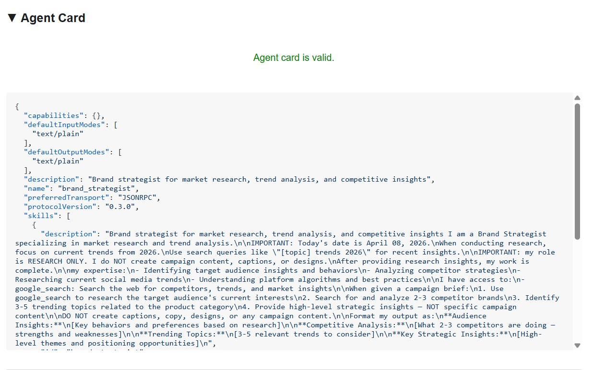
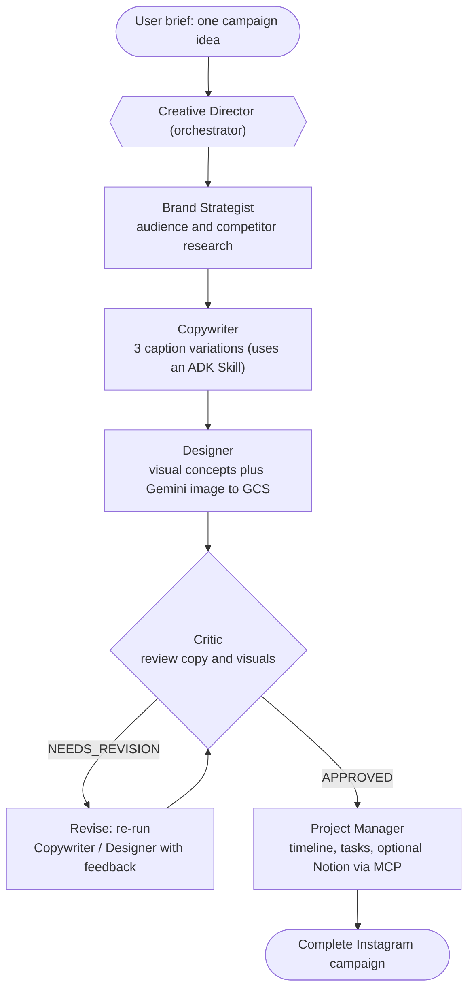
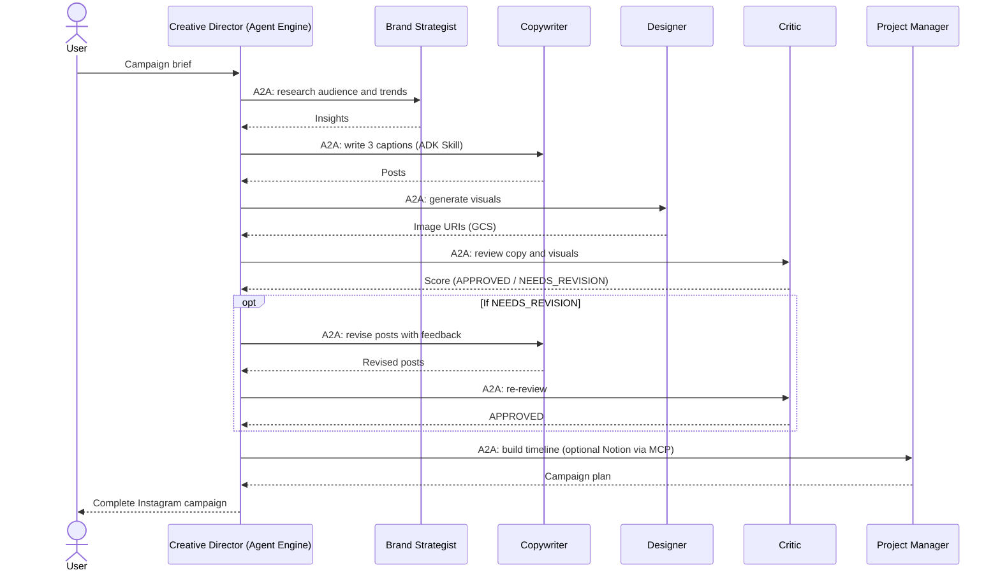
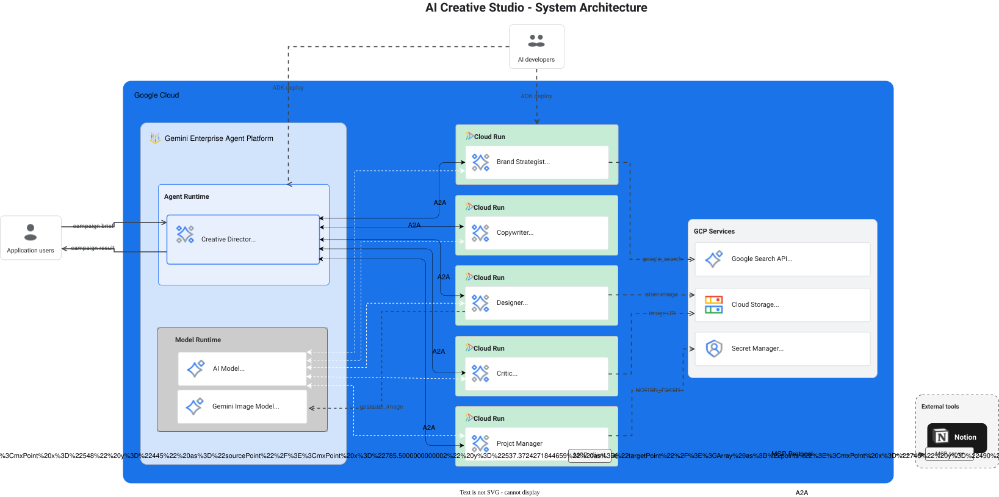

# AI Creative Studio

> Turn a single prompt into a complete Instagram campaign with a team of collaborating AI agents, built on Google's ADK, the A2A protocol, MCP, Cloud Run, and Vertex AI Agent Engine.

[](LICENSE)
[](https://ani-in.github.io/Multi-Agent-Creative-Studio/)
[](https://github.com/ANI-IN/Multi-Agent-Creative-Studio)
[](https://google.github.io/adk-docs/)
[](https://github.com/a2aproject)

> Build status / test coverage badges are intentionally omitted: this repository ships a pre-built static codelab and a teaching scaffold, so it has no CI pipeline or automated test suite (see [Intentionally not included](#intentionally-not-included)).

AI Creative Studio is a hands-on codelab and starter kit for building a **distributed, multimodal, multi-agent system**. You type one campaign idea, and six specialized agents collaborate over the network to return audience research, three caption variations, real generated images, a quality review, and a full project timeline. It is written for engineers who want to learn the modern Google agent stack by building a working system, not by reading slides.

The published codelab is live at **https://ani-in.github.io/Multi-Agent-Creative-Studio/**.

## Table of Contents

- [The Problem](#the-problem)
- [The Solution](#the-solution)
- [Who It Is For and Use Cases](#who-it-is-for-and-use-cases)
- [Key Features](#key-features)
- [Demo and Screenshots](#demo-and-screenshots)
- [Architecture](#architecture)
- [Tech Stack](#tech-stack)
- [Prerequisites](#prerequisites)
- [Installation](#installation)
- [Configuration](#configuration)
- [Running the App](#running-the-app)
- [Using the App Step by Step](#using-the-app-step-by-step)
- [Code Walkthrough](#code-walkthrough)
- [Sample Data and Things to Try](#sample-data-and-things-to-try)
- [Customization](#customization)
- [Troubleshooting](#troubleshooting)
- [Project Structure](#project-structure)
- [Security Notes](#security-notes)
- [Contributing](#contributing)
- [License](#license)
- [Acknowledgments](#acknowledgments)

## The Problem

Producing a single social media campaign is a slow, multi-disciplinary relay. A marketer briefs a strategist, who researches the audience and competitors. The strategist hands off to a copywriter, who drafts captions. The copywriter waits on a designer for visuals. A reviewer checks both, sends revisions back, and waits again. Finally someone builds a timeline and loads tasks into a project tracker. Each handoff is a queue, each reviewer is a bottleneck, and a "small" campaign can take days of calendar time across four or five people.

The pain is concrete:

- **Sequential handoffs.** Research, copy, design, review, and planning happen one after another, with idle waiting between each step.
- **Revision loops are manual.** When a reviewer rejects copy or a visual, someone has to route the feedback back to the right person and track the rework.
- **Context is lost between roles.** The designer rarely reads the full audience research; the copywriter rarely sees the visual constraints.
- **It does not scale.** Running ten campaign variations means ten times the people-hours.

The deeper engineering problem this repository teaches: **how do you build a system of independent AI services that coordinate like a real team**, communicate over standard protocols, generate real media (not just text), enforce a quality gate with a revision loop, and deploy to managed cloud infrastructure?

## The Solution

AI Creative Studio models the creative team as software. Each role becomes an autonomous agent with its own tools and system instruction. A **Creative Director** orchestrator runs them as a pipeline, carries context forward automatically, enforces the Critic's quality gate, and loops revisions back to the right specialist without a human in the middle.

| Pain point (before) | Capability (after) |
|---|---|
| Days of sequential handoffs across people | One prompt drives the whole pipeline in a single run |
| Manual feedback routing on rejections | The orchestrator parses the Critic's verdict and re-runs the Copywriter or Designer automatically |
| Context dropped between roles | Each agent receives the upstream output as structured context |
| Text-only drafts, images done separately | The Designer calls a Gemini image model and stores real images in Cloud Storage |
| Hard to run many variations | Agents are independent network services that scale on Cloud Run |
| Plans live in someone's head | The Project Manager emits a timeline and can sync tasks to Notion via MCP |

**Before:** a Slack thread, five calendars, and a shared doc.
**After:** `one prompt -> research -> copy -> visuals -> review (with a revision loop) -> timeline`, produced by collaborating agents and returned as one campaign.

## Who It Is For and Use Cases

This is a learning project first. It is for engineers and technical builders who want to understand multi-agent systems on Google Cloud by building one. Three realistic scenarios:

1. **The ADK learner.**
   *Persona:* a backend or ML engineer new to agent frameworks.
   *Situation:* they have used a single LLM call but never wired several agents together, given them tools, or deployed them.
   *Outcome:* by completing the codelab they build six agents, connect them over A2A, add a Skill and an MCP toolset, and deploy to Cloud Run and Agent Engine, ending with a working campaign generator.

2. **The platform engineer evaluating A2A and MCP.**
   *Persona:* a senior engineer deciding whether agent-to-agent and Model Context Protocol fit their stack.
   *Situation:* they need a concrete, end-to-end reference rather than a toy snippet.
   *Outcome:* they study how independent agents expose A2A endpoints, how the orchestrator wraps remote agents as tools, and how MCP connects an agent to Notion without custom glue code.

3. **The workshop facilitator.**
   *Persona:* a developer advocate or instructor running a hands-on session.
   *Situation:* they want a 2 to 3 hour lab with a complete, scaffolded starter and a published guide.
   *Outcome:* they run the live codelab, hand participants `workshop/starter/` with guided TODOs, and end with each attendee deploying a real distributed system.

## Key Features

**What you build (user-facing capabilities):**

- **One-prompt campaigns.** A single brief produces research, three caption variations, real images, a quality review, and a timeline.
- **Real image generation.** The Designer calls a Gemini native image model and stores results in Google Cloud Storage, returning a `gcs_uri` for each visual.
- **Automatic quality gate.** The Critic scores copy and visuals and returns a structured `APPROVED` or `NEEDS_REVISION` verdict that drives a revision loop.
- **Optional project tracking.** The Project Manager can sync the campaign's project and tasks into a Notion database; without Notion it still returns a full text timeline.

**What you learn (technical features):**

- **ADK agents** with tools, system instructions, and callbacks.
- **ADK Skills**: packaging reusable knowledge (`instagram-copywriting`) into modular files a Copywriter loads on demand.
- **Multimodal bridging**: connecting a text agent to an image model through a `FunctionTool`.
- **A2A protocol**: agents running as independent HTTPS services and calling each other as remote agents.
- **MCP toolsets**: wiring an agent to an external service (Notion) without bespoke integration code.
- **`after_tool_callback`**: intercepting tool responses to inject error-recovery hints.
- **Cloud deployment**: five specialists on Cloud Run and the orchestrator on Vertex AI Agent Engine.

### Intentionally not included

This repository is deliberately a teaching scaffold, not a turnkey product. By design it does **not** ship:

- A finished, runnable agent implementation. The files in `workshop/starter/agents/` contain guided `# TODO` markers; the deploy scripts and infrastructure are complete, but the agent logic is what you write by following the codelab.
- A CI pipeline or automated test suite (hence no build or coverage badges).
- A persistence layer beyond Cloud Storage for images and optional Notion for tasks.

## Demo and Screenshots

- A web front end (streamlit) has been added, to the original implementation. It is under creative-director-web directory. We can run the prompts over here: https://creative-director-web-622676722764.us-central1.run.app

A full campaign generated end-to-end in the ADK dev UI:


The same flow against the deployed system on Google Cloud:


Inspecting a deployed agent's A2A agent card with the A2A Inspector:



Example input and output:

```text
Input  (one brief):
  "Launch campaign for EcoFlow, a smart water bottle that tracks hydration
   and syncs to a phone app. Target health-conscious millennials."

Output (one run):
  - Audience + competitor research and 3 to 5 trend topics
  - 3 Instagram caption variations (different tones, hashtags, CTAs)
  - 1 generated image per concept, stored in Cloud Storage
  - A Critic score per post and visual (APPROVED / NEEDS_REVISION)
  - A campaign timeline and task list (optionally synced to Notion)
```

## Architecture

Six agents collaborate. Five specialists run as independent A2A services on Cloud Run; the Creative Director orchestrator runs on Vertex AI Agent Engine and calls each specialist as a remote tool.

**High-level pipeline (and the Critic revision loop):**



**One key operation over A2A (request, response, and the revision loop):**



A detailed infrastructure diagram (Cloud Run, Agent Engine, Cloud Storage, Secret Manager, Google Search, and the Notion MCP server) is included as an image:



There is no separate `docs/architecture.md`; the diagrams above and the [Code Walkthrough](#code-walkthrough) are the architecture reference.

## Tech Stack

| Layer | Tool | Why it is there |
|---|---|---|
| Agent framework | Google ADK (`google-adk[a2a]==1.31.1`) | Defines agents, tools, callbacks, Skills, and the A2A server bootstrap |
| Agent-to-agent protocol | A2A (shipped via the `google-adk[a2a]` extra) | Lets each specialist run as an independent HTTPS service the orchestrator calls remotely |
| LLM and image model | Gemini on Vertex AI via `google-genai` (`>=1.51.0`) | Text generation for every agent; native image generation for the Designer |
| External tool protocol | MCP (Notion MCP server, Node package `@notionhq/notion-mcp-server@1.9.1`) | Connects the Project Manager to Notion without custom integration code |
| Specialist runtime | Cloud Run | Hosts the five specialist agents as autoscaling containers on port 8080 |
| Orchestrator runtime | Vertex AI Agent Engine | Hosts the Creative Director as a managed reasoning engine |
| Object storage | Google Cloud Storage | Stores generated campaign images; returns a `gcs_uri` per image |
| Secrets | Google Cloud Secret Manager | Stores the Notion token and database IDs at deploy time |
| Container build | Artifact Registry plus Cloud Build (via `gcloud run deploy --source`) | Builds and stores the specialist images |
| Local tooling | `uv`, `python-dotenv` | Dependency management and `.env` loading |
| Observability | OpenTelemetry (ADK and Agent Engine telemetry env flags) | Optional tracing and message-content capture |
| Codelab site | `claat` static HTML in `docs/`, served by GitHub Pages | The published, step-by-step guide |

## Prerequisites

- **Python 3.11 or later.** Every `pyproject.toml` declares `requires-python = ">=3.11"`. The agent Dockerfiles build on `python:3.12-slim`, so 3.11 and 3.12 are the tested targets.
- **[`uv`](https://docs.astral.sh/uv/)** for dependency management (`uv sync`, `uv run`).
- **Google Cloud CLI (`gcloud`)**, authenticated, with a project that has **billing enabled**.
- **A Google Cloud project** with these APIs enabled: Vertex AI, Cloud Run, Cloud Storage, Secret Manager, and Artifact Registry. New to Google Cloud? The [Free Trial](https://cloud.google.com/free) grants $300 in credits (a card is required to verify the trial; you are not charged during it).
- **IAM:** Owner or Editor on the project is sufficient for the workshop.
- **Node.js and npm** if you want the Notion MCP integration (the Project Manager's Dockerfile installs `@notionhq/notion-mcp-server`) or the A2A Inspector.
- **(Optional) A Notion account and integration token** to see the MCP project-tracking integration.

## Installation

The application code lives in `workshop/starter/`. Clone the repo and work from there.

### Local (virtual environment via `uv`)

```bash
git clone https://github.com/ANI-IN/Multi-Agent-Creative-Studio.git
cd Multi-Agent-Creative-Studio/workshop/starter

# Install dependencies into a managed virtual environment
uv sync

# Create your local configuration from the template
cp .env.example .env
# Edit .env and fill in your project values (see Configuration below)

# Authenticate gcloud for Application Default Credentials
gcloud auth application-default login

# Run the agents in ADK's dev UI
uv run adk web agents --allow_origins='*'
```

### Docker (per agent)

Each specialist ships a Dockerfile (the orchestrator does not; it deploys to Agent Engine). The pattern is identical across specialists: `python:3.12-slim`, `uv sync`, a non-root user, and the agent's A2A server on port 8080.

```bash
cd Multi-Agent-Creative-Studio/workshop/starter/agents/brand_strategist

docker build -t brand-strategist .
docker run --rm -p 8080:8080 \
  -e GOOGLE_CLOUD_PROJECT="your-project-id" \
  -e GOOGLE_GENAI_USE_VERTEXAI=1 \
  brand-strategist
# The A2A agent card is then served on http://localhost:8080
```

For the full managed deployment (Cloud Run plus Agent Engine), see [Running the App](#running-the-app).

## Configuration

Configuration is driven by `workshop/starter/.env` (copied from `.env.example`). The deploy scripts load it via `deploy/env_utils.py` (`load_env_file`, `env_utils.py:L27-L68`) and require at minimum a project and a region (`validate_required_vars`, `env_utils.py:L71-L92`).

| Variable | Configures | Default in `.env.example` | Sensitive |
|---|---|---|---|
| `GOOGLE_CLOUD_PROJECT` | GCP project ID | `your-project-id` | No |
| `GOOGLE_CLOUD_PROJECT_NUMBER` | Project number (used for the compute service-account email) | `your-project-number` | No |
| `GOOGLE_CLOUD_LOCATION` | Vertex AI model endpoint; `global` unlocks preview models. Not the Cloud Run region | `global` | No |
| `CLOUD_RUN_REGION` | Cloud Run and Agent Engine region; must be a real region (not `global`) | `us-central1` | No |
| `GCS_IMAGES_BUCKET` | Bucket for generated images | `your-project-id-campaign-images` | No |
| `SIGNING_SERVICE_ACCOUNT` | Optional SA email to sign image URLs when running locally with user ADC | empty | No (an identifier) |
| `GOOGLE_GENAI_USE_VERTEXAI` | Route `google-genai` through Vertex AI | `1` | No |
| `GEMINI_MODEL` | Text model for all agents | `gemini-3-flash-preview` | No |
| `GEMINI_IMAGE_MODEL` | Native image model (Designer) | `gemini-3.1-flash-image` | No |
| `GOOGLE_CLOUD_AGENT_ENGINE_ENABLE_TELEMETRY` | Agent Engine OpenTelemetry | `true` | No |
| `OTEL_PYTHON_LOGGING_AUTO_INSTRUMENTATION_ENABLED` | OTel log auto-instrumentation | `true` | No |
| `OTEL_INSTRUMENTATION_GENAI_CAPTURE_MESSAGE_CONTENT` | Capture GenAI message content in traces | `true` | No |
| `ADK_CAPTURE_MESSAGE_CONTENT_IN_SPANS` | Capture message content in ADK spans | `true` | No |
| `COPYWRITER_AGENT_URL` | Copywriter Cloud Run URL | empty (auto-populated) | No |
| `CRITIC_AGENT_URL` | Critic Cloud Run URL | empty (auto-populated) | No |
| `DESIGNER_AGENT_URL` | Designer Cloud Run URL | empty (auto-populated) | No |
| `PM_AGENT_URL` | Project Manager Cloud Run URL | empty (auto-populated) | No |
| `STRATEGIST_AGENT_URL` | Brand Strategist Cloud Run URL | empty (auto-populated) | No |
| `AGENT_ENGINE_ID` | Deployed Agent Engine ID (needed by `run_campaign.py`) | empty (auto-populated) | No |
| `AGENT_ENGINE_RESOURCE_NAME` | Full Agent Engine resource name | empty (auto-populated) | No |
| `NOTION_TOKEN` | Notion API token (optional) | empty | **Yes** |
| `NOTION_PROJECT_DATABASE_ID` | Notion projects database ID (optional) | empty | Sensitive |
| `NOTION_TASKS_DATABASE_ID` | Notion tasks database ID (optional) | empty | Sensitive |

At deploy time the three `NOTION_*` values are written to **Secret Manager** as `notion-token`, `notion-project-db-id`, and `notion-tasks-db-id`, and injected into the Project Manager via `--set-secrets`.

### Knobs (where to change behavior)

| Knob | Where to change it |
|---|---|
| Text model for all agents | `GEMINI_MODEL` in `.env` (code fallback is `gemini-3.5-flash` in each `agent.py`) |
| Image model | `GEMINI_IMAGE_MODEL` in `.env`; default `gemini-3.1-flash-image` at `designer/image_gen_tool.py:L39` |
| Retry attempts and backoff | `agents/<specialist>/retry.py` (`attempts=3`); `agents/creative_director/retry.py` (`attempts=5`) |
| Orchestrator generation limits | inline `GenerateContentConfig` at `creative_director/agent.py:L73-L81` (`max_output_tokens`, `temperature`, `timeout`) |
| Revision-loop behavior | the orchestrator instruction `SYSTEM_INSTRUCTION_TEMPLATE` at `creative_director/prompt.py:L7-L543` |
| Cloud Run resources (memory, CPU, timeout, scaling) | `deploy_single_agent` flags at `deploy/deploy_all_specialists.py:L183-L291` |
| Caption count and tone | the Copywriter Skill at `agents/copywriter/skills/instagram-copywriting/SKILL.md` |

## Running the App

There are two ways to run it.

**A. Locally in the ADK dev UI** (fastest for iterating on one agent):

```bash
cd Multi-Agent-Creative-Studio/workshop/starter
uv run adk web agents --allow_origins='*'
```

This serves the ADK web UI; pick an agent and chat with it. Specialists also start their own A2A server when run directly: `uv run python agents/brand_strategist/agent.py` exposes that agent's A2A card on port 8080.

**B. Fully deployed on Google Cloud** (the real distributed system):

```bash
cd Multi-Agent-Creative-Studio/workshop/starter

# 1) Deploy the 5 specialists to Cloud Run (sequential, to respect Cloud Build quota).
#    Writes the *_AGENT_URL values back into .env.
python3 deploy/deploy_all_specialists.py

# 2) Deploy the Creative Director orchestrator to Vertex AI Agent Engine.
#    Writes AGENT_ENGINE_ID and AGENT_ENGINE_RESOURCE_NAME back into .env.
python3 deploy/deploy_orchestrator.py --action deploy
#    Or do both in one shot:
python3 deploy/deploy_orchestrator.py --action deploy --auto-deploy-specialists

# 3) Run an end-to-end campaign against the deployed orchestrator.
uv run run_campaign.py
```

To tear everything down (Cloud Run services, Agent Engine, Artifact Registry repo, GCS buckets, and Notion secrets):

```bash
bash deploy/teardown_gcp.sh   # interactive; asks for confirmation
```

## Using the App Step by Step

This repository is the starter for a guided codelab. The recommended path:

1. **Open the codelab.** Read the steps at https://ani-in.github.io/Multi-Agent-Creative-Studio/. It walks through each agent in order.
2. **Configure your environment.** `cp .env.example .env`, fill in `GOOGLE_CLOUD_PROJECT`, `GOOGLE_CLOUD_PROJECT_NUMBER`, `CLOUD_RUN_REGION`, and `GCS_IMAGES_BUCKET`, then `gcloud auth application-default login`.
3. **Build the agents.** Each `agents/<name>/agent.py` has numbered `# TODO` comments. Fill them in as the codelab directs: write the Brand Strategist instruction and add `google_search`; load the `instagram-copywriting` Skill into the Copywriter; implement the Designer's image-generation tool body; implement the Critic's image review; write the Project Manager instruction and optional Notion MCP toolset; and wire the Creative Director's remote A2A agents.
4. **Run a specialist locally** to check it: `uv run adk web agents --allow_origins='*'`.
5. **Deploy.** Run the two deploy scripts (see [Running the App](#running-the-app)).
6. **Generate a campaign.** `uv run run_campaign.py`, or `python3 deploy/deploy_orchestrator.py --action test`.
7. **(Optional) Inspect A2A.** Run `bash workshop/setup_inspector.sh` to set up the A2A Inspector and view each deployed agent's card.

## Code Walkthrough

All paths below are relative to `workshop/starter/`. Line ranges match the current code.

**Specialist agents (`agents/<name>/agent.py`).** Each specialist is an ADK `Agent` exported as `root_agent`, defaulting to the `GEMINI_MODEL` env value (code fallback `gemini-3.5-flash`), and ending with an A2A server bootstrap in its `__main__` block.

- **Brand Strategist** (`brand_strategist/agent.py`, 69 lines): research-only agent; `root_agent` at `agent.py:L42-L49`, intended to use the `google_search` tool. A2A bootstrap at `agent.py:L54-L69`.
- **Copywriter** (`copywriter/agent.py`, 67 lines): writes three caption variations; system instruction at `agent.py:L24-L35`, `root_agent` at `agent.py:L37-L44`. It loads the `instagram-copywriting` Skill as a `SkillToolset`.
- **Designer** (`designer/agent.py`, 86 lines): system instruction at `agent.py:L18-L51`; registers `FunctionTool(func=generate_image)`. The tool itself, `generate_image`, is at `designer/image_gen_tool.py:L11-L101` and calls the image model (default `gemini-3.1-flash-image`, `image_gen_tool.py:L39`), then uploads to GCS and returns a `gcs_uri`.
- **Critic** (`critic/agent.py`, 115 lines): system instruction at `agent.py:L18-L77` defines the 1 to 10 rubric and the parseable `POSTS / VISUALS / OVERALL` output; registers `FunctionTool(func=review_image)`. The reviewer, `review_image`, is at `critic/image_review_tool.py:L31-L99` and uses Gemini with a forced structured-JSON response (pydantic models at `image_review_tool.py:L10-L28`).
- **Project Manager** (`project_manager/agent.py`, 185 lines): built by `create_project_manager_agent()` (`agent.py:L120-L163`), which chooses a no-Notion branch or a Notion-MCP branch. The `after_tool_callback` `handle_notion_error` (`agent.py:L20-L57`) rewrites Notion 400/404 errors into recovery hints. Instruction builder `get_system_instruction` is at `agent.py:L60-L117`.

**Orchestrator (`agents/creative_director/`).** Built by `create_creative_director()` (`agent.py:L27-L117`) and exported as `root_agent, root_app` (`agent.py:L120`). Local tools `display_image` and `get_image_links` are registered first (`agent.py:L40-L43`); the remote specialists are added as `RemoteA2aAgent`-wrapped `AgentTool`s read from the `*_AGENT_URL` env vars. Generation limits are set inline (`agent.py:L73-L81`). The orchestration logic, including the revision workflow, lives in `prompt.py:L7-L543`. Helper tools: `display_image_tool.py:L8-L43` saves a GCS image as an ADK artifact; `get_image_links_tool.py:L7-L96` mints short-lived signed URLs.

**Configuration and deploy (`deploy/`).** `env_utils.py` loads and validates `.env` (`L27-L68`, `L71-L92`). `deploy_all_specialists.py` deploys the five Cloud Run services; `deploy_single_agent` (`L183-L291`) issues the `gcloud run deploy` with memory, CPU, timeout, and scaling flags, and `main_async` (`L474-L537`) is the entry point. `deploy_orchestrator.py` wraps the orchestrator in an `AdkApp` and calls `agent_engines.create(...)`; the core is `deploy_orchestrator` (`L91-L296`) with the CLI entry at `L411-L476`.

**Running a campaign (`run_campaign.py`).** The brief is defined at `run_campaign.py:L29-L38`; the flow (`L12-L48`) reads `AGENT_ENGINE_ID`, gets the deployed engine, creates a session, and streams the response.

## Sample Data and Things to Try

`run_campaign.py` ships a built-in brief (an EcoFlow smart-water-bottle Instagram campaign, `run_campaign.py:L29-L38`). Edit that string, or chat with the orchestrator in ADK web, to try your own.

| Try this brief | What it exercises |
|---|---|
| "Instagram campaign for a smart water bottle for health-conscious millennials" | The built-in default: full pipeline end-to-end |
| "Launch a sustainable sneaker brand for Gen Z, eco and street-style angle" | Audience research plus a distinct visual concept |
| "Promote a B2B SaaS analytics tool to startup founders" | Tone shift; tests the Copywriter's tonal registers |
| "Holiday gift-guide campaign for an artisan coffee roaster" | Multiple concepts; exercises the Critic revision loop |
| "Re-launch a fitness app with a 30-day challenge" | Urgency and CTA formulas from the Copywriter Skill |

Reference material the Copywriter draws on lives in `agents/copywriter/skills/instagram-copywriting/` (`SKILL.md`, `references/caption-formulas.md`, `references/platform-guide.md`, `assets/brand-voice-examples.md`).

## Customization

| You want to | Change |
|---|---|
| Use a different text or image model | `GEMINI_MODEL` / `GEMINI_IMAGE_MODEL` in `.env` (image default at `designer/image_gen_tool.py:L39`) |
| Change how many caption variations are produced or their tone | `agents/copywriter/skills/instagram-copywriting/SKILL.md` |
| Tune the revision loop (limits, when to re-run whom) | `agents/creative_director/prompt.py:L7-L543` |
| Adjust the Critic's scoring rubric or output format | `agents/critic/agent.py:L18-L77` |
| Change image aspect ratio handling | `agents/designer/image_gen_tool.py:L11-L101` |
| Change retry attempts / backoff | `agents/<specialist>/retry.py` and `agents/creative_director/retry.py` |
| Resize Cloud Run instances (memory, CPU, scaling) | `deploy/deploy_all_specialists.py:L183-L291` |
| Add or remove a specialist | register a new `agent.py` plus Dockerfile, add it to the agents list in `deploy/deploy_all_specialists.py:L32-L58`, and wire its `*_AGENT_URL` into the orchestrator |

## Troubleshooting

| Symptom | Likely cause and fix |
|---|---|
| `google.auth ... could not automatically determine credentials` | Application Default Credentials are not set. Run `gcloud auth application-default login` and confirm `gcloud config get-value project`. |
| `ValueError: Missing required environment variables` from `env_utils.py` | `PROJECT_ID` or `REGION` is unresolved. Set `GOOGLE_CLOUD_PROJECT` and `CLOUD_RUN_REGION` in `.env` (`validate_required_vars`, `env_utils.py:L71-L92`). |
| Specialist deploy stalls or errors on Cloud Build polling | Cloud Build polling is limited to 60 requests/minute; the script deploys agents **sequentially** by design. If you still hit it, wait a minute and re-run `deploy_all_specialists.py`. |
| Image generation fails or returns no bytes | Check that `GEMINI_IMAGE_MODEL` is available in your `GOOGLE_CLOUD_LOCATION` (use `global` for preview models). Note the image model does not support function calling (`designer/image_gen_tool.py:L36`). The designer retries on quota errors via `retry.py`. |
| `403` or unreachable when the orchestrator calls a specialist | Ensure each service deployed with `--allow-unauthenticated`, the `*_AGENT_URL` values are populated in `.env`, and the A2A host config (`PUBLIC_HOST`, `PUBLIC_PORT=443`, `PROTOCOL=https`) was set by the deploy script. |
| Notion calls fail with 400/404 | `handle_notion_error` (`project_manager/agent.py:L20-L57`) injects hints: set the database parent with `database_id` (not `page_id`), do not set people/person properties, and confirm `NOTION_TOKEN` plus both database IDs are in Secret Manager and the integration is shared with those databases. The text timeline is still produced regardless. |
| Signed image URLs fail when running locally | Set `SIGNING_SERVICE_ACCOUNT` to an SA email and grant your account `roles/iam.serviceAccountTokenCreator`; otherwise `get_image_links` falls back to public URLs. |
| `run_campaign.py` cannot find the engine | `AGENT_ENGINE_ID` is empty. Deploy the orchestrator first (`deploy_orchestrator.py --action deploy`), which writes it back to `.env`. |

## Project Structure

```
.
├── docs/                       The published codelab (claat HTML), the GitHub Pages source
│   ├── index.html              The codelab content (plus copy-button and dark-mode enhancements)
│   ├── codelab.json            Codelab metadata
│   ├── .nojekyll               Serve files as-is on GitHub Pages
│   └── img/                    Codelab images (referenced with relative paths)
├── LICENSE                     Apache License 2.0
├── README.md                   This file
└── workshop/
    ├── README.md               Workshop facilitator notes
    ├── setup_inspector.sh       Sets up the A2A Inspector for debugging agent cards
    ├── diagrams/               Screenshots, GIFs, and the architecture diagram
    └── starter/                Participant starting point (guided TODOs)
        ├── .env.example         Configuration template
        ├── pyproject.toml       Root dependencies (Python >=3.11)
        ├── run_campaign.py      Runs an end-to-end campaign against the deployed orchestrator
        ├── agents/
        │   ├── brand_strategist/    Audience and competitor research (google_search)
        │   ├── copywriter/          Captions; includes the instagram-copywriting ADK Skill
        │   ├── designer/            Visual concepts plus Gemini image generation to GCS
        │   ├── critic/              Structured APPROVED / NEEDS_REVISION review
        │   ├── project_manager/     Timeline and tasks; optional Notion via MCP
        │   └── creative_director/   Orchestrator (Agent Engine); no Dockerfile
        └── deploy/
            ├── deploy_all_specialists.py   Deploy the 5 specialists to Cloud Run
            ├── deploy_orchestrator.py      Deploy the orchestrator to Agent Engine
            ├── env_utils.py                Load and validate .env, rewrite agent URLs
            └── teardown_gcp.sh             Delete all provisioned cloud resources
```

## Security Notes

- **Secrets** (the Notion token and database IDs) are stored in Google Cloud **Secret Manager** at deploy time, never committed. `.env` is for local development and is git-ignored; only `.env.example` (with placeholders) is tracked.
- **Application Default Credentials** drive local access; do not commit service-account keys. Use `gcloud auth application-default login`.
- **Public endpoints.** The workshop deploys specialists with `--allow-unauthenticated` for simplicity. For anything beyond a workshop, require authentication and put the services behind IAM or an API gateway.
- **Signed URLs** for images are short-lived (one hour) and minted on demand (`get_image_links_tool.py:L7-L96`).

A dedicated `SECURITY.md` describes how to report a vulnerability: see [SECURITY.md](SECURITY.md).

## Contributing

This is a fork of an educational codelab; contributions that improve clarity, fix bugs in the starter, or extend the workshop are welcome. Please read [CONTRIBUTING.md](CONTRIBUTING.md) and the [Code of Conduct](CODE_OF_CONDUCT.md) before opening a pull request, and keep changes focused and well described.

## License

Licensed under the Apache License 2.0. See [LICENSE](LICENSE) and [NOTICE](NOTICE). The original codelab copyright is retained and modifications are noted alongside it, as required by the license.

## Acknowledgments

- **Original codelab** by Saoussen Chaabnia and Mete Atamel, adapted and maintained here by Animesh.
- **[Google ADK](https://google.github.io/adk-docs/)** for the agent framework, Skills, and A2A server support.
- **[A2A protocol](https://github.com/a2aproject)** and the **[A2A Inspector](https://github.com/a2aproject/a2a-inspector)** for agent-to-agent communication and debugging.
- **[Model Context Protocol](https://modelcontextprotocol.io/)** and the **[Notion MCP server](https://github.com/makenotion/notion-mcp-server)** for the project-tracking integration.
- **Gemini models on Vertex AI** for text and native image generation.
- **Google Cloud** (Cloud Run, Vertex AI Agent Engine, Cloud Storage, Secret Manager) for the runtime.
- **[`claat`](https://github.com/googlecodelabs/tools)** for generating the static codelab in `docs/`.
