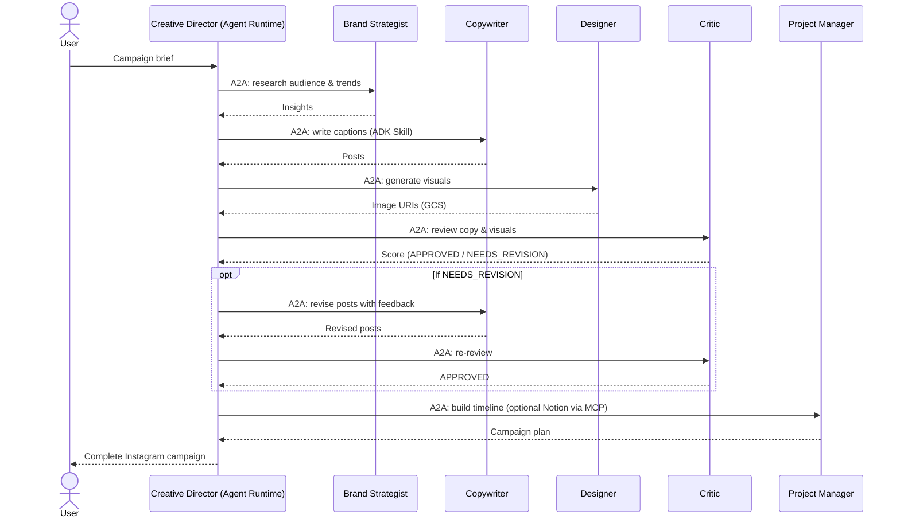

# AI Creative Studio: Workshop

## Build a Multi-Agent Creative Studio with Google's Agent Stack: ADK, A2A, MCP on Cloud Run & Agent Runtime

This directory contains all the materials for the hands-on workshop codelab.

### Directory Structure

```
workshop/
├── diagrams/               # Screenshots and GIFs used in the codelab
├── setup_inspector.sh      # A2A Inspector setup helper
└── starter/                # Starter code given to participants
    ├── agents/             # Agent stubs with TODO comments
    └── deploy/             # Deployment scripts
```

> The published codelab lives in the `docs/` directory at the **repository root** (a sibling of `workshop/`, not inside it).

### What Participants Build

A distributed multimodal multi-agent system for Instagram campaign generation:

| Agent | Platform | Role |
|---|---|---|
| Brand Strategist | Cloud Run | Market research with Google Search |
| Copywriter | Cloud Run | Instagram captions using ADK Skills |
| Designer | Cloud Run | Visual concepts + real image generation via Gemini |
| Critic | Cloud Run | Quality review and structured feedback |
| Project Manager | Cloud Run | Timeline, tasks, and Notion sync via MCP |
| Creative Director | Gemini Enterprise Agent Platform Runtime | Orchestrator that routes tasks via A2A |

### How a campaign flows over A2A

Each specialist is an independent service with its own HTTPS endpoint. The Creative Director (deployed to Gemini Enterprise Agent Platform Runtime) calls them over the **A2A protocol** as remote agents, one step at a time, and only advances past the Critic once the review comes back `APPROVED`. The Project Manager optionally syncs the resulting tasks to Notion through an MCP toolset.



### Workshop Details

| | |
|---|---|
| **Duration** | ~2.5 hours |
| **Level** | Intermediate |
| **Environment** | GCP Cloud Shell |
| **Topics** | Google ADK, ADK Skills, A2A Protocol, MCP, Multimodal, Cloud Run, Gemini Enterprise Agent Platform Runtime |

### Prerequisites for Participants

- Google Cloud project with billing enabled
- Owner or Editor IAM role
- (Optional) Notion account for MCP integration

### Starter Code

The `starter/` directory contains the code participants start from:

- Agent files have numbered `# TODO` comments guiding participants through each implementation step
- Deploy scripts are fully functional; participants only implement agent logic
- Pre-written infrastructure includes retry config, error handling callbacks, and MCP toolset setup

### Published Codelab

The codelab is published via GitHub Pages at [ani-in.github.io/Multi-Agent-Creative-Studio](https://ani-in.github.io/Multi-Agent-Creative-Studio/).

The `docs/` directory (at the repository root) is the GitHub Pages source. Commit changes there to publish updates.
